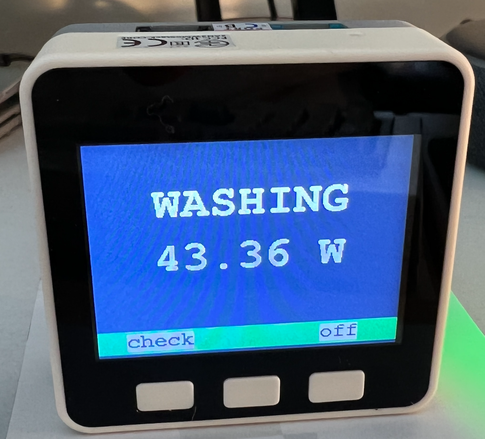

# Remote Washing Machine Monitor

A remote clothes washer monitor based on a cute little M5Core (ESP32) module. The M5Core will wake up when the washing machine is turned on and display a "Wash" animatio while the cycle completes. When the cycle is complete, the M5Core will display a "Wash Complete" animation and play an MP3 file. A "Snooze" option is available otherwise the M5Core will continue to alert every 30 seconds.



For the most flexibility, most of the state machine is contained in a NodeRed flow and not on the M5Core device itself. The device itself monitors an MQTT topic and displays, alerts, animates based on those messages.

## Details

- Platformio code in C++
- Uses MQTT for sending and receiving messages
- m5go/update for sending commands to the device

```
"topic": "m5go/update",
"payload": {
    "title":"WASHING",
    "subtitle": `120 W`,
    "color":"green",
    "animation": 3,
    "sound": null,
    "menu":["check",null,"off"]
}
```

- m5go/button to report button presses; "A", "B", "C", and "P" on startup.